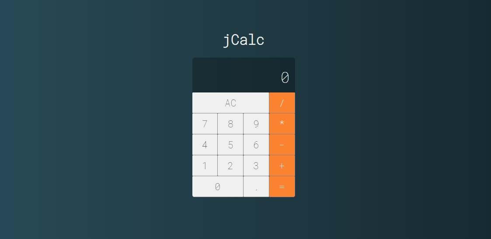

# jCalc 2

- **Developed by:** [Julio L. Muller](https://www.linkedin.com/in/juliolmuller/)
- **Project proposed by:** [Cod3r](https://www.cod3r.com.br/)
- **Released on:** Apr 23, 2020
- **Updated on:** Apr 23, 2020
- **Latest version:** 2.0.0
- **License:** *MIT*

## Overview

Application developed to work as a fully functional pocket calculator. It is part of my personal portfolio of JavaScript/Vue.js projects.

## Run Application

Take a look at this application running through [this link](https://juliolmuller.github.io/jcalc-2/).

## Resources

- Traditional calculations with `+`, `-`, `*`, `/` and also `%`;
- Continuous calculations by pressing `=` repeatedly;
- Support to 1 or 2 inputs only in the operation;
<!-- - Adjustment of the number to 10-digits maximum on the display; -->
<!-- - Errors throwing on division by zero and number over 10 integer digits; -->
- Sounds on typing (with icon for enabling/disabling); and
<!-- - Keyboard input compatibility:
  - `0` trhu `9` to enter numbers
  - `+`, `-`, `*`, `/` and `%` to add operators
  - `.` or `,` to enter decimal separator
  - `Enter` to get the result (`=` sign)
  - `Backspace` to CE (clear current entry)
  - `Escape` to AC (clear all operation)
- Copy (`Ctrl+C`) & Paste (`Ctrl+V`) support; -->

## Project setup

Run `npm install` to download all dependecnies and get the project set up.

## Development server

Run `npm run serve` for a dev server. Navigate to `http://localhost:8080/`. The app will automatically reload if you change any of the source files.

## Build

Run `npm run build` to build the project. The build artifacts will be stored in the `docs/` directory.
